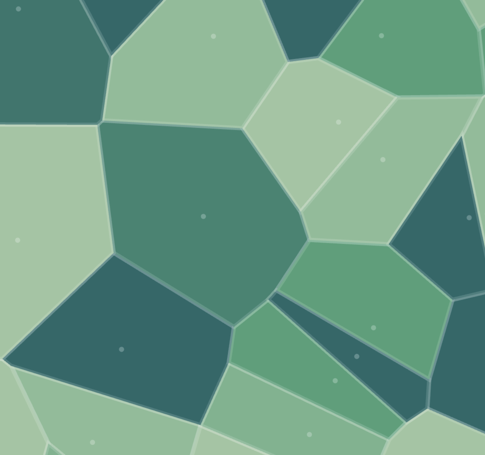

# Voronoi Diagram 

## Overview

The application creates a dynamic visualization of a Voronoi diagram where points move according to a physics simulation. Users can interact with the diagram through various controls.

## Key Features

1. **Animated Voronoi Diagram**: Points move continuously, creating a constantly changing Voronoi tessellation
2. **Interactive Controls**: Users can adjust parameters like point count, animation speed, and visual options
3. **Fixed Color Scheme**: Each point maintains a consistent color throughout its lifetime
4. **Responsive Design**: Automatically adjusts to window resizing

## Technical Implementation

### Core Algorithms

1. **Delaunay Triangulation**: Implemented using the Bowyer-Watson algorithm in the [`delaunay()`](index.html#L207-L246) function
2. **Voronoi Diagram Generation**: Converts Delaunay triangulation to Voronoi cells in the [`buildVoronoi()`](index.html#L263-L287) function
3. **Polygon Clipping**: Uses the Sutherland-Hodgman algorithm to clip Voronoi cells to screen boundaries in the [`clipPolygon()`](index.html#L290-L315) function

### Physics Simulation

The [`update()`](index.html#L318-L344) function handles:
- Point movement with velocity
- Boundary collision detection
- Velocity clamping

### Rendering System

The [`render()`](index.html#L352-L382) function:
- Clears and redraws the canvas each frame
- Draws Voronoi cells with their assigned colors
- Optionally renders cell borders and site points

### UI Components

The interface includes:
- Point count slider (5-600 points)
- Animation speed control
- Toggle for cell borders
- Toggle for showing site points
- Randomize and Pause/Resume buttons

### Color Generation

The [`randomColor()`](index.html#L147-L152) function generates consistent HSL colors based on a seed value, ensuring each point maintains its color throughout the animation.

## Architecture

The application follows a functional programming approach with:
- Global state management for parameters and site data
- A main animation loop using `requestAnimationFrame`
- Separation of concerns between physics, geometry, and rendering
- Event-driven UI updates

The code is organized in a linear fashion:
1. Utilities and globals
2. Canvas setup and resize handling
3. Parameter definitions
4. UI event wiring
5. Color generation
6. Site management functions
7. Geometric algorithms (Delaunay, Voronoi, clipping)
8. Physics and animation functions
9.  Main render loop

This self-contained implementation demonstrates advanced computational geometry concepts in a visually appealing and interactive web application.